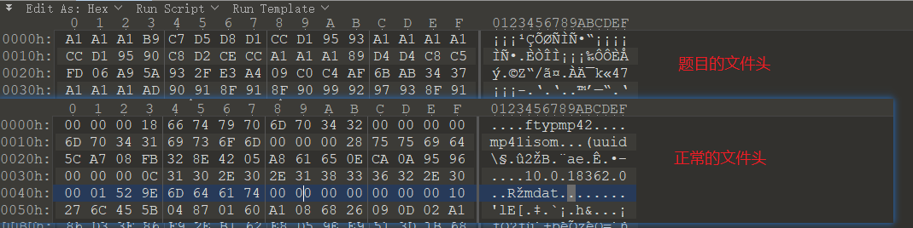

### wp

很简单的题目，看文件后缀名是m4a。通过16进制编辑器查看，发现文件头很奇葩，这里可以通过新建一个m4a文件来对比，发现其实就是整个文件于A1进行异或了。



按照异或的特性，我们把题目的文件再和A1异或一次即可，脚本如下：

```
import struct
import os


def turnxor(filename, xorbyte):
    with open(filename, 'rb') as file:
        with open(filename+".m4a", "wb") as outfile:
            all = file.read()
            for b in all:
                b = struct.pack('!B', b)
                outfile.write(bxor(b, xorbyte))


def bxor(b1, b2):  # use xor for bytes
    parts = []
    for b1, b2 in zip(b1, b2):
        parts.append(bytes([b1 ^ b2]))
    return b''.join(parts)


def main():
    xorbyte = b'\xa1'
    filename = 'vip.m4a.m4a'
    turnxor(filename, xorbyte)


if __name__ == "__main__":
    main()

```

