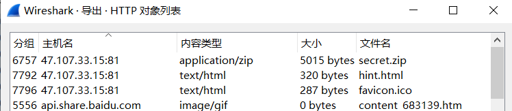
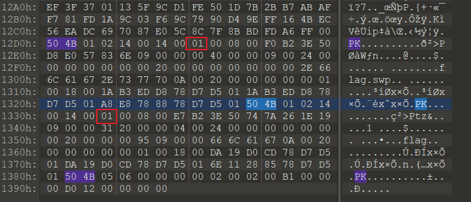
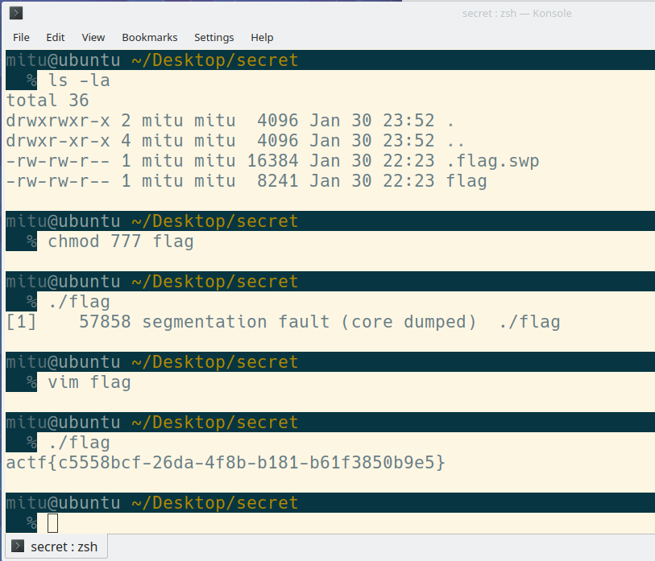

### wp

流量包，在查看对象-htpp中，可以看一个secret.zip和hint.html，都导出来看看

发现secret.zip加密了，然后再hint.html中发现了提示说不需要密码，可以猜测是伪加密：

有两种办法，一是手动修改回去：标志位为奇数则伪加密，偶数则没有加密，将图中两个数值修改为偶数即可。

二是直接放在linux环境下，可以无视伪加密，直接解压，然后是flag和.flag.swp，这个swp文件明显是vim的备份文件，直接`vim flag`，然后选择recover即可，从文件头确定是一个可执行文件，执行即可。

