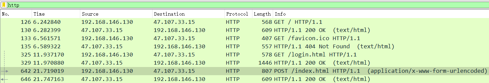
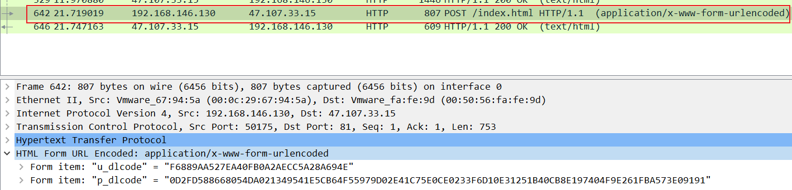
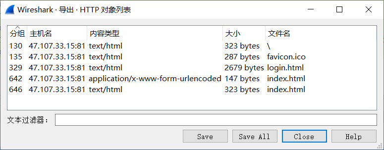
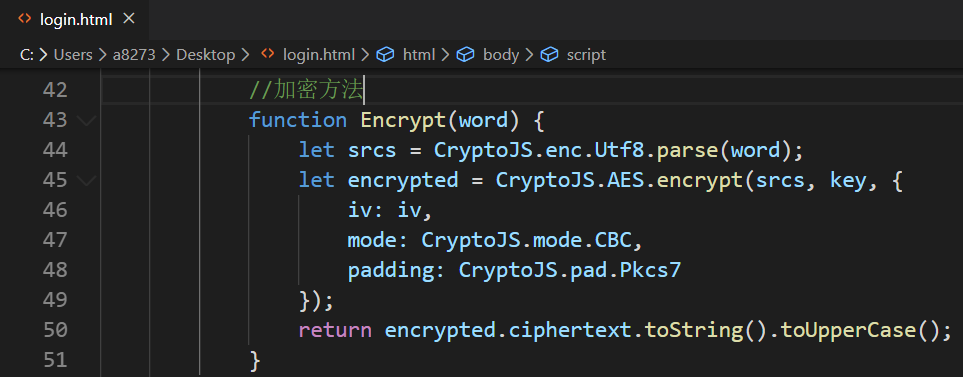
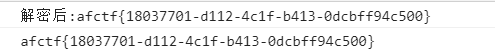

### wp

打开流量包，可以发现是个关于http的流量包

过滤只剩下http协议的数据包，内容极少，可以确定是个登录的流程



在这个数据中可以看见很长的密码



然后可以把访问的网页导出，也可以直接访问。



发现是个aes加密，密钥也知道了，传输的数据也知道了，解密即可。



解密代码如下：

```
<!DOCTYPE html>
<html lang="en">
  <head>
    <meta charset="UTF-8" />
    <meta
      name="viewport"
      content="width=device-width, user-scalable=no, initial-scale=1.0, maximum-scale=1.0, minimum-scale=1.0"
    />
    <title>Document</title>
  </head>

  <body>
    <script src="https://cdnjs.cloudflare.com/ajax/libs/crypto-js/3.1.9-1/crypto-js.js"></script>

    <script>
      const key = CryptoJS.enc.Utf8.parse('1234123412ABCDEF')
      const iv = CryptoJS.enc.Utf8.parse('ABCDEF1234123412')
      //解密方法
      function Decrypt(word) {
        let encryptedHexStr = CryptoJS.enc.Hex.parse(word)
        let srcs = CryptoJS.enc.Base64.stringify(encryptedHexStr)
        let decrypt = CryptoJS.AES.decrypt(srcs, key, {
          iv: iv,
          mode: CryptoJS.mode.CBC,
          padding: CryptoJS.pad.Pkcs7
        })
        let decryptedStr = decrypt.toString(CryptoJS.enc.Utf8)
        return decryptedStr.toString()
      }

      //加密方法
      function Encrypt(word) {
        let srcs = CryptoJS.enc.Utf8.parse(word)
        let encrypted = CryptoJS.AES.encrypt(srcs, key, {
          iv: iv,
          mode: CryptoJS.mode.CBC,
          padding: CryptoJS.pad.Pkcs7
        })
        return encrypted.ciphertext.toString().toUpperCase()
      }

      var AES =
        '0D2FD588668054DA021349541E5CB64F55979D02E41C75E0CE0233F6D10E31251B40CB8E197404F9E261FBA573E09191'
      var AFTERAES = Decrypt(AES)
      console.log('解密后:' + AFTERAES)
      console.log(AFTERAES)
    </script>
  </body>
</html>

```

