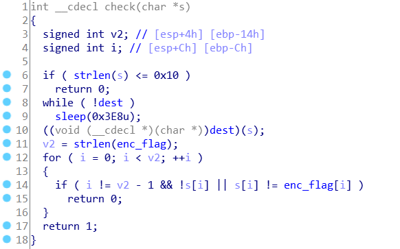
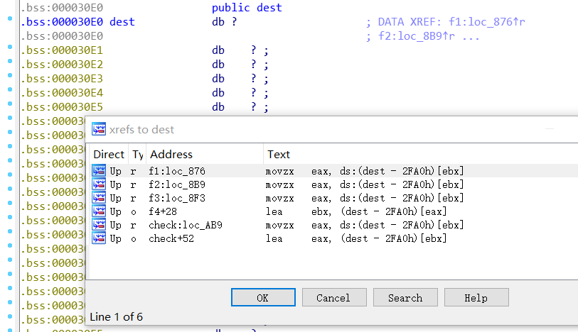
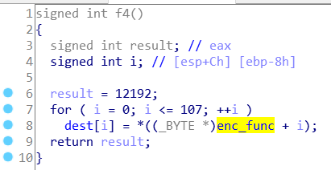
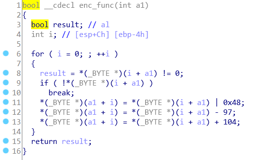
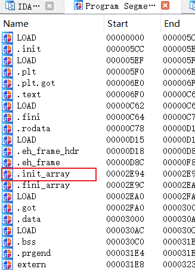
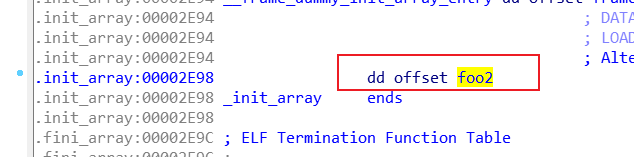
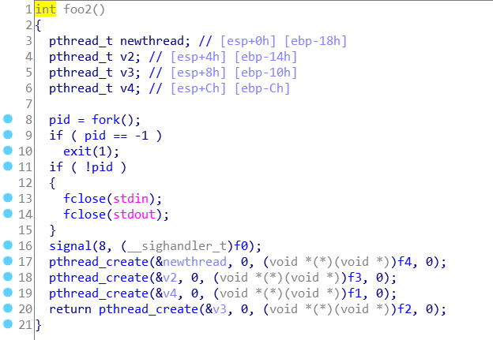

#### SOLUTION

1. 逻辑很简单，直接看 `check` 函数

   

2. 可以注意到 `dest` 部分，~~又~~是~~该死的~~数据变函数，最开始 `dest` 部分没有被填充，可以通过引用看到，在好几个地方被改动了

   

3. 挨个可以看到好几个修改部分，其中 f4 是最开始的部分，将 `enc_func` 拷贝到 `dest`

   

   

   可以看到 `enc_func` 里的 `|` 是不可逆操作，应该是由其他部分修改。修改其他部分，可得到真正的 `Check`，本题结束。

4. 分析下发生了什么，大概就是 多线程。

   init_array 段里放了一个函数

   

   

   

一些复杂的点没实现加入，是一道简单的多线程，动态调试可解决，当然多线程动态调试也挺有意思（不是