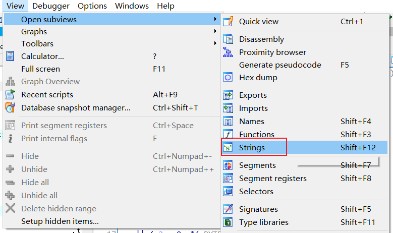
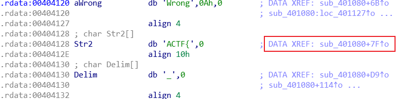
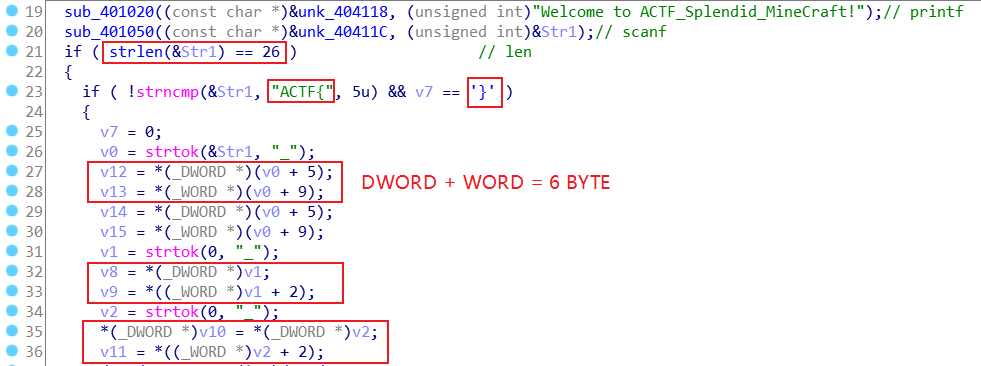
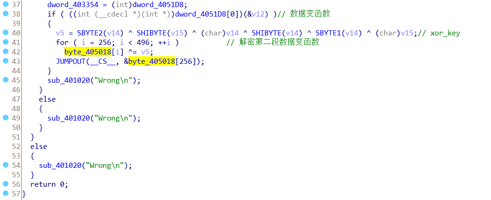
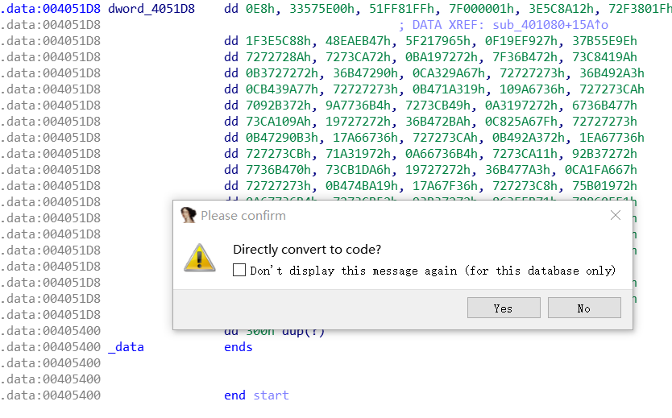
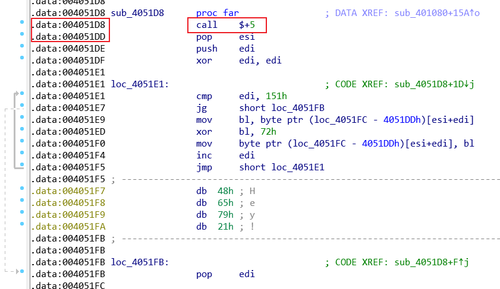
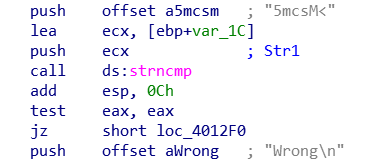

#### SOLUTION

1. IDA / OD

2. 首先找到主函数，可通过字符串查找

   

   

3. 

   flag 长度为 26，被 `_` 分割分成了 3 段，每段六个字节即 6 个字符，可得到 flag 形式：`flag{123456_abcdef_UVWXYZ}`

4. 

   这里第一个判断，data 变 code

   

   

   首先是汇编  `call $+5; pop esi ` ，写过病毒的朋友们应该知道，这个语句可以获得 `pop esi` 这句指令的地址；后面一部分是做了后面一段的异或，这段类似于壳。解密后面的语句，逻辑简单，就是3个数组异或判断而已，可得第一段 `yOu0y*`。

5. 根据之前主函数中的语句，只有第一段解出，才能通过计算异或值，解密第二段函数。第二段就是表替换，0x100 表替换很常见，数据和汇编代码混杂在一起考察选手汇编功底（不是，别打我。

   脚本懒得写了（不是

6. 第三段直接送了，字符串比较，（写汇编太累了，不是

   

7. 得到 flag `ACTF{yOu0y*_knowo3_5mcsM<}`。本题主要用了自修改代码（self-modifying code），程序执行的代码随着程序的运行而改变，所以我们需要动态调试XDDD，调试过程中往往需要直面汇编，所以要有比较好的汇编基础XDDD

