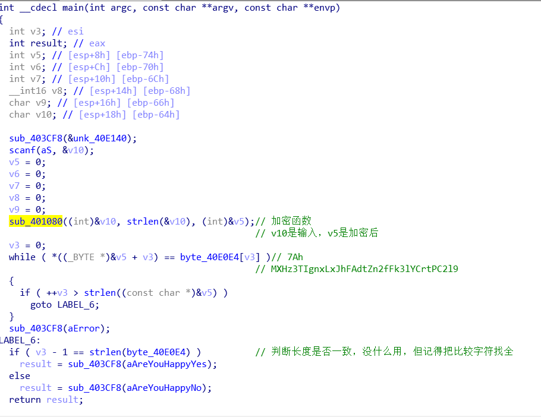
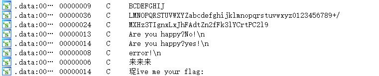
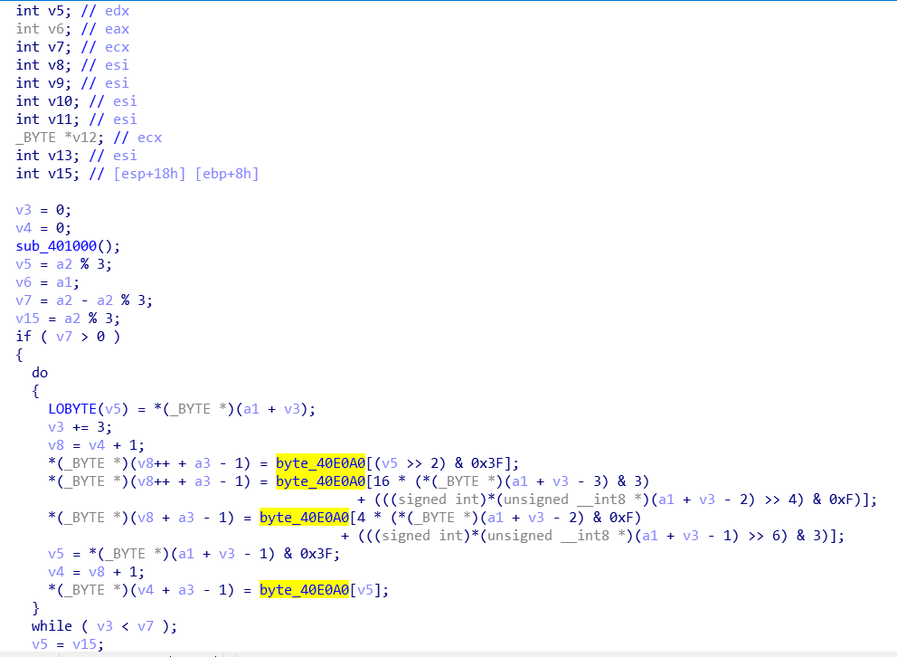
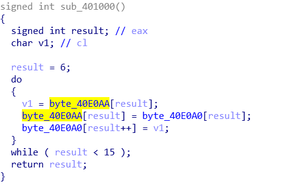
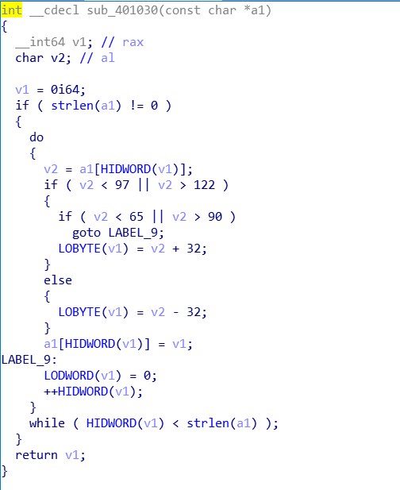

### 题目分析

用IDA打开，到main函数中：



逻辑很简单，加密函数只有一个：sub_401080，加密后和byte_40E0E4比对

再看一下字符串，shift+f12



眼熟的字符表，再想想题目，常见的加密

sub_401080:



byte_40E0A0是字符表，眼熟的加密，猜测是base64加密

从头看一眼，开头有一个函数sub_401000



这个函数对字符表做了改动，改动后的字符表才是真正的字符表，变形的base

看到最后，返回的是sub_401030加密的结果

sub_401030



没什么复杂的逻辑，对大小写做了判断，并变换

### 解题

变形的base脚本具体怎么写我就不赘述了，别的也没什么复杂的，上个最终脚本

```python
import base64
#flag = 'flag{bAse64_h2s_a_Surprise}'
enflag = 'zMXHz3TIgnxLxJhFAdtZn2fFk3lYCrtPC2l9' 
input_s = ''
dic = 'ABCDEFQRSTUVWXYPGHIJKLMNOZabcdefghijklmnopqrstuvwxyz0123456789+/'
sdic = 'ABCDEFGHIJKLMNOPQRSTUVWXYZabcdefghijklmnopqrstuvwxyz0123456789+/'

tab = str.maketrans(dic,sdic)

enflag_l = list(enflag)
for i in range(len(enflag)):
  if enflag[i].isupper():
    enflag_l[i] = chr(ord(enflag[i])+32)
  if enflag[i].islower():
    enflag_l[i] = chr(ord(enflag[i])-32)

enflag = str(enflag_l)

input_s = base64.b64decode(enflag.translate(tab).encode("utf-8"))
print(input_s)
#输出： 'flag{bAse64_h2s_a_Surprise}'
```


