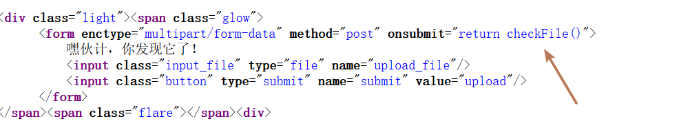
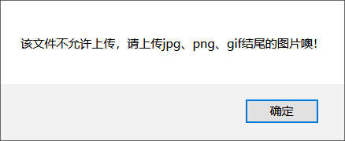

**文件上传**。web安全中经典的攻击方式之一。网上可以查到很多相关资料。

利用方式简单来讲就是：想办法上传php文件到服务器上，再通过该php文件来执行我们想要的命令。此时这个php文件通常被称为webshell/一句话木马/...

F12翻源码可以看到前端有个js检验

直接上传也可以发现弹窗，这是一个前端的回显，绕过前端我们可以直接**burpsuite抓包，修改包内容来绕过。**

绕过上传php文件会发现回显"bad file"。这是后端的检验处理。经过多次修改后缀可以推测出是黑名单检验。或者有经验的CTFer马上会去尝试php的代替----php3、php4、**phtml**等

最后发现phtml可以绕过检测。根据回显的上传文件的路径，**使用”菜刀“类工具连接**在根目录下找到flag。

