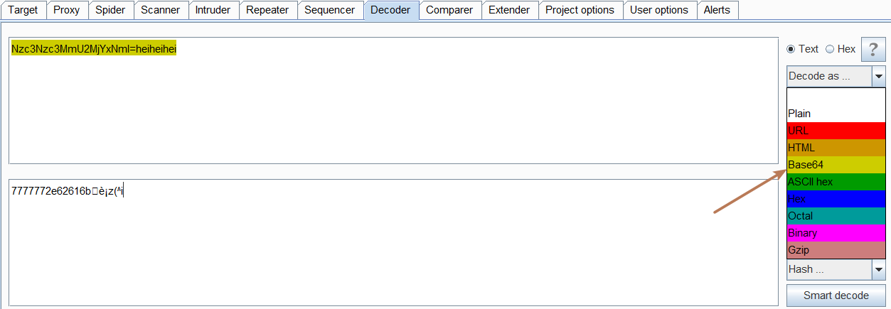
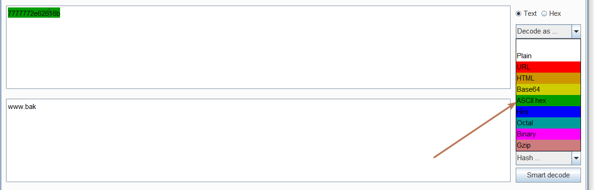

F12翻源码发现注释

```
<!--Nzc3Nzc3MmU2MjYxNmI=heiheihei-->
```

很明显是个base64，base64通常以“=”结尾，后面的多余字符删去即可。



可以使用在线的base64解密，或者直接用burpsuite自带的Decoder模块（可以发现尽管不删去前面的解码也正常--得到7777772e62616b）。

一串hex字符串。想到hex编码



解出来源码备份。


拿到源码直接搜源码大概都能搜出来利用点？

curl函数的利用，最基本的一个SSRF利用案例。

提示了flag in /flag。 直接file协议读取即可