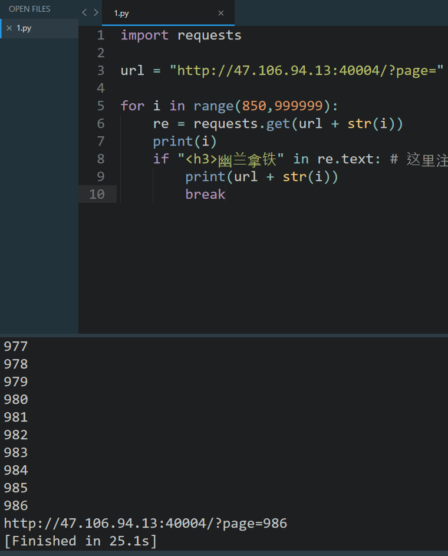

F12翻源码提示要找“幽兰拿铁”。随意翻几页发现都没有。（直接刷新当前页面会发现每次展示都不一样，猜到是随机生成的页面。那么肯定有某一页存在我们要找的“幽兰拿铁”）

这种一页一页翻是不太可能的，写脚本自动化利用。

```python
import requests

url = "http://47.106.94.13:40004/?page="

for i in range(0,999999):
	re = requests.get(url + str(i))
	print(i)
	if "<h3>幽兰拿铁" in re.text: # 这里注意按照商品名称的格式来写，直接写'幽兰拿铁'会匹配到源码中的提示那行
		print(url + str(i))
		break
```



简单跑一下然后去访问即可得到flag